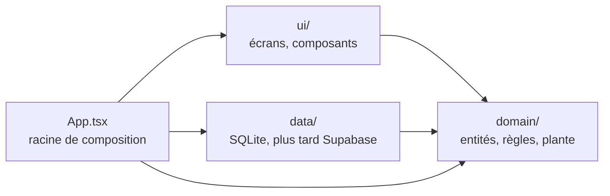

# Architecture

Ce document décrit comment le code est organisé et pourquoi. Les raisons des
choix de stack sont dans [l'ADR 0001](decisions/0001-stack-et-architecture.md).

## Le produit en une phrase

L'utilisateur suit des habitudes qu'il veut **arrêter** (« jours sans fumer »).
Le compteur avance tout seul avec le temps ; le seul événement saisi est une
**rechute**. Chaque habitude est une plante en pixel art qui pousse jour après
jour, garde une trace visible de chaque rechute, et repousse.

## Les trois couches



| Couche    | Contient                                                                                | Peut importer              |
| --------- | --------------------------------------------------------------------------------------- | -------------------------- |
| `domain/` | Entités, règles métier, générateur de plante, interfaces de repository. TypeScript pur. | rien d'autre que `domain/` |
| `data/`   | Implémentations des repositories (expo-sqlite aujourd'hui, Supabase plus tard).         | `domain/`                  |
| `ui/`     | Écrans et composants. Ils affichent et délèguent, ils ne calculent pas.                 | `domain/`                  |

### La règle de dépendance : `ui -> domain <- data`

Les flèches pointent vers le domaine : c'est lui qui contient ce qui a de la
valeur (les règles), et il ne doit dépendre d'aucun détail technique. On peut
alors :

- **tester** tout le domaine avec Jest, sans téléphone, sans base de données ;
- **remplacer** SQLite par Supabase (ou les deux) sans toucher une ligne du
  domaine ;
- **changer** l'interface graphique sans risquer de casser une règle métier.

### Comment `data/` peut dépendre du domaine et pas l'inverse

C'est l'**inversion de dépendance**. Le domaine déclare ce dont il a besoin
sous forme d'interface, par exemple :

```ts
// src/domain/… (prévu, pas encore écrit)
export interface RelapseRepository {
  listByHabit(habitId: HabitId): Promise<Relapse[]>;
  add(relapse: Relapse): Promise<void>;
}
```

`data/` fournit une classe qui **implémente** cette interface avec SQLite. Le
domaine ne connaît que l'interface ; il ne sait pas qu'SQLite existe.

### La racine de composition

Quelqu'un doit bien créer l'implémentation SQLite et la donner à l'interface
graphique. Ce rôle revient à `App.tsx`, à la racine du projet, hors des trois
couches : c'est le **seul** endroit autorisé à importer `ui/`, `domain/` et
`data/` à la fois. `ui/` n'importe donc jamais `data/` directement.

### Vérification automatique

La règle n'est pas qu'une convention : `npm run lint` échoue si elle est
violée (voir `eslint.config.js`).

- `import/no-restricted-paths` interdit `domain -> data`, `domain -> ui`,
  `data -> ui` et `ui -> data`.
- `no-restricted-imports` interdit à `domain/` d'importer React, React Native,
  Expo, Zustand, Skia ou Supabase.

## Modèle de données prévu

Rien de ceci n'est encore codé. Deux entités :

```ts
type HabitId = string; // UUID
type LocalDate = string; // 'YYYY-MM-DD', jour calendaire local

interface Habit {
  id: HabitId;
  name: string;
  seed: number; // entier 32 bits, tiré une seule fois à la création
  startDate: LocalDate; // premier jour du suivi
  createdAt: string; // instant ISO 8601 UTC
}

interface Relapse {
  id: string; // UUID
  habitId: HabitId;
  date: LocalDate; // startDate <= date <= aujourd'hui
  deletedAt: string | null; // instant ISO 8601 UTC si la rechute est annulée
}
```

### Règles sur les rechutes

- **Saisie rétroactive autorisée**, pour n'importe quel jour entre `startDate`
  et aujourd'hui inclus. **Jamais dans le futur.** La validation est une règle
  du domaine : elle reçoit `today` en paramètre, comme le générateur.
- **Annulation par suppression logique.** Annuler une rechute renseigne
  `deletedAt` ; la ligne n'est jamais effacée. Toutes les lectures métier
  ignorent les rechutes dont `deletedAt` n'est pas `null`.
- **Pourquoi pas une vraie suppression :** avec la synchronisation, un appareil
  qui ne voit plus une ligne ne sait pas si elle a été supprimée ailleurs ou si
  elle n'a jamais existé. Une suppression logique est une donnée comme une
  autre : synchroniser revient à fusionner des lignes, sans cas particulier.

### Choix et raisons

- **UUID générés sur l'appareil**, pas d'auto-incrément SQLite. Avec la
  synchronisation, deux appareils créeront des objets hors ligne ; deux
  auto-incréments donneraient le même `1`.
- **`LocalDate` pour `startDate` et `Relapse.date`.** « J'ai rechuté mardi » est
  un jour du calendrier, pas un instant. Un timestamp UTC ferait glisser une
  rechute de 23 h vers le lendemain selon le fuseau horaire.
- **`createdAt` reste un instant**, car c'est un fait technique (quand la ligne
  a été créée), pas une notion métier. `startDate` et `createdAt` peuvent
  différer : on peut commencer à suivre une habitude arrêtée il y a 10 jours.
- **La série courante n'est pas stockée.** Elle se calcule à partir de
  `startDate`, des rechutes et de la date du jour. Ne stocker que les faits
  évite qu'un compteur et l'historique se contredisent.
- **Pas de `CheckIn`.** Dans une habitude à arrêter, un jour sans événement est
  un jour réussi : il n'y a rien à cocher.

### Questions ouvertes (à trancher avec la première fonctionnalité)

- Plusieurs rechutes actives le même jour : une seule compte pour la série, mais
  la case du jour montre-t-elle une trace simple ou une trace par rechute ?
- `startDate` peut-elle être dans le futur (« j'arrête lundi ») ? Par défaut :
  non, `startDate <= aujourd'hui`.

## La plante : une fonction pure

```
plante = f(seed, startDate, rechutes, aujourd'hui)
```

Le générateur, dans `domain/`, renvoie une **description** de la plante (une
grille de pixels, ou une liste d'éléments positionnés), pas une image. `ui/` la
dessine avec react-native-skia. Le domaine ne sait rien de Skia.

### Pourquoi une fonction pure

Une fonction pure renvoie toujours le même résultat pour les mêmes entrées et ne
lit rien d'autre que ses paramètres.

- **Rien à stocker.** On ne sauvegarde jamais d'image ; la plante se recalcule
  à chaque affichage. Pas de fichier à gérer, rien à migrer.
- **Rien à synchroniser.** Plus tard, pour que la plante soit identique sur
  deux appareils, il suffit de synchroniser `seed`, `startDate` et les rechutes.
- **Testable.** On fixe les entrées, on vérifie la sortie. Pas de mock d'écran.
- **Unique.** Le `seed` rend chaque plante différente, de façon reproductible.

### Ce qu'on injecte, et pourquoi

Une fonction pure ne peut pas appeler `Date.now()` ni `Math.random()` : ce
serait lire un état caché, et le résultat changerait d'un appel à l'autre.

- **La date du jour** est un paramètre (`today: LocalDate`). En test, on simule
  « dans 30 jours » en passant une autre date.
- **L'aléatoire** ne sert qu'une fois : tirer le `seed` à la création de
  l'habitude. Le générateur de nombres aléatoires est injecté dans la fonction
  de création, ce qui permet un seed fixe en test. Ensuite, toute la
  « variété » de la plante vient d'un générateur pseudo-aléatoire **déterministe**
  initialisé avec ce `seed`.

### Contrainte : la croissance se fait par ajout seulement

Chaque jour depuis `startDate` a une **position stable** dans la plante. Ce qui
a déjà poussé ne bouge plus jamais : demain, on ajoute ; on ne redessine pas.

Le générateur sépare deux choses :

- **La géométrie** (où se trouve chaque jour) dépend **seulement** de `seed`
  et de l'index du jour `n` (nombre de jours depuis `startDate`). Les rechutes
  ne la modifient jamais.
- **L'apparence** de la case du jour `n` dépend de `seed`, de `n` et des
  rechutes actives **de ce jour-là uniquement**.

```
position(n)   = g(seed, n)
apparence(n)  = h(seed, n, rechutesDuJour(n))
plante        = [ (position(n), apparence(n)) pour n de 0 à index(aujourd'hui) ]
```

`aujourd'hui` sert seulement à savoir **jusqu'où** dessiner.

Pourquoi ce découpage :

- **La saisie et l'annulation rétroactives sont sûres.** Ajouter ou annuler une
  rechute pour le jour `n` ne change que la case `n`. Rien d'autre ne bouge,
  ni avant, ni après.
- **Les notes datées pourront s'accrocher** à `position(n)` sans jamais être
  déplacées.
- **Propriétés testables**, qui seront les tests clés du générateur :
  - la plante d'aujourd'hui est un **préfixe** de la plante de demain ;
  - ajouter ou annuler une rechute au jour `n` ne modifie **que** la case `n` ;
  - les positions sont identiques avec ou sans rechutes.
- Une rechute ne supprime rien : elle laisse une trace visible à son jour, et
  les jours sans rechute qui suivent continuent de pousser. C'est ainsi que la
  plante « repousse ».

**Ce que ce choix exclut, volontairement :** une apparence qui dépendrait des
jours précédents (par exemple des feuilles plus jeunes juste après une
rechute). Une saisie rétroactive changerait alors l'apparence de tous les jours
suivants. Si on veut un jour cet effet, il faudra le calculer à part, comme une
couche d'affichage, sans toucher aux positions.

La **série courante**, elle, n'est pas soumise à cette contrainte : c'est un
nombre calculé (jours depuis la dernière rechute active, ou depuis
`startDate`), pas un élément de la plante.

## Prévu plus tard (documenté, non conçu)

- **Notes datées** : `Note { id, habitId, date: LocalDate, text }`. Une pensée
  ou une difficulté écrite un jour donné apparaît comme une feuille ou une fleur
  à la position de ce jour ; on la relit en touchant cet endroit. Facultative,
  sans pénalité. C'est la position stable par jour qui rend cela possible.
- **Arrosage facultatif**, sans pénalité si on ne le fait pas. À concevoir.
- **Comptes et synchronisation (Supabase)** : une seconde implémentation des
  repositories dans `data/`. La suppression logique (`deletedAt`) est déjà
  prévue ; il faudra probablement ajouter `updatedAt` pour résoudre les
  conflits entre appareils, et appliquer la suppression logique à `Habit`.
