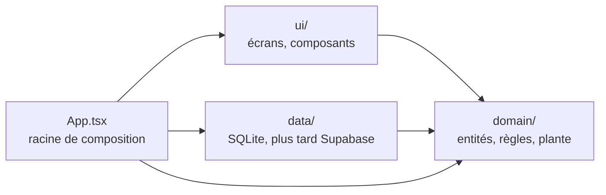

# Architecture

Ce document décrit comment le code est organisé et pourquoi. Les raisons des
choix de stack sont dans [l'ADR 0001](decisions/0001-stack-et-architecture.md).

## Le produit en une phrase

L'utilisateur suit des habitudes qu'il veut **arrêter** (« jours sans fumer »).
Le compteur avance tout seul avec le temps ; le seul événement saisi est une
**rechute**. Chaque habitude est une plante en pixel art qui pousse jour après
jour, garde une trace visible de chaque rechute, et repousse.

L'app se veut un **compagnon de poche, doux et sans jugement**. Chaque habitude
est une plante d'intérieur posée sur une étagère ; on veut que les gens aient
envie de collectionner les plantes.

## Principes du produit

Ces principes priment sur toute idée de fonctionnalité. Une proposition qui en
contredit un est refusée ou retravaillée.

- **La plante ne meurt jamais.**
- **La santé de la plante est toujours récupérable.**
- **Aucun message culpabilisant, aucune notification de reproche.**
- **Une rechute laisse une trace, pas une punition.**
- **Écrire une note est toujours facultatif.**

Les idées notées pour plus tard sont dans [idees.md](idees.md).

## Les trois couches



| Couche    | Contient                                                                                | Peut importer              |
| --------- | --------------------------------------------------------------------------------------- | -------------------------- |
| `domain/` | Entités, règles métier, générateur de plante, interfaces de repository. TypeScript pur. | rien d'autre que `domain/` |
| `data/`   | Implémentations des repositories (expo-sqlite aujourd'hui, Supabase plus tard).         | `domain/`                  |
| `ui/`     | Écrans et composants. Ils affichent et délèguent, ils ne calculent pas.                 | `domain/`                  |

### La règle de dépendance : `ui -> domain <- data`

Les flèches pointent vers le domaine : c'est lui qui contient ce qui a de la
valeur (les règles), et il ne doit dépendre d'aucun détail technique. On peut
alors :

- **tester** tout le domaine avec Jest, sans téléphone, sans base de données ;
- **remplacer** SQLite par Supabase (ou les deux) sans toucher une ligne du
  domaine ;
- **changer** l'interface graphique sans risquer de casser une règle métier.

### Comment `data/` peut dépendre du domaine et pas l'inverse

C'est l'**inversion de dépendance**. Le domaine déclare ce dont il a besoin
sous forme d'interface, par exemple :

```ts
// src/domain/… (prévu, pas encore écrit)
export interface RelapseRepository {
  listByHabit(habitId: HabitId): Promise<Relapse[]>;
  add(relapse: Relapse): Promise<void>;
}
```

`data/` fournit une classe qui **implémente** cette interface avec SQLite. Le
domaine ne connaît que l'interface ; il ne sait pas qu'SQLite existe.

### La racine de composition

Quelqu'un doit bien créer l'implémentation SQLite et la donner à l'interface
graphique. Ce rôle revient à `App.tsx`, à la racine du projet, hors des trois
couches : c'est le **seul** endroit autorisé à importer `ui/`, `domain/` et
`data/` à la fois. `ui/` n'importe donc jamais `data/` directement.

### Vérification automatique

La règle n'est pas qu'une convention : `npm run lint` échoue si elle est
violée (voir `eslint.config.js`).

- `import/no-restricted-paths` interdit `domain -> data`, `domain -> ui`,
  `data -> ui` et `ui -> data`.
- `no-restricted-imports` interdit à `domain/` d'importer React, React Native,
  Expo, Zustand, Skia ou Supabase.

## Modèle de données

Deux entités, dans `src/domain/habit.ts` et `src/domain/relapse.ts` :

```ts
type HabitId = string; // UUID
type LocalDate = string; // 'YYYY-MM-DD', jour calendaire local

interface Habit {
  id: HabitId;
  name: string;
  seed: number; // entier 32 bits, tiré une seule fois à la création
  species: string; // espèce de la plante, ex. 'monstera' (voir plus bas)
  startDate: LocalDate; // premier jour du suivi, startDate <= aujourd'hui
  createdAt: string; // instant ISO 8601 UTC
}

interface Relapse {
  id: string; // UUID déterministe, calculé à partir de (habitId, date)
  habitId: HabitId;
  date: LocalDate; // startDate <= date <= aujourd'hui
  deletedAt: string | null; // instant ISO 8601 UTC si la rechute est annulée
  updatedAt: string; // instant ISO 8601 UTC de la dernière modification
}
// Unicité : une seule rechute par (habitId, date), lignes annulées comprises.
```

### L'espèce de la plante (`Habit.species`)

- Une nouvelle habitude reçoit une espèce **connue** du registre. En attendant
  l'écran de choix, elle est tirée au hasard avec le générateur injecté.
- **Espèce inconnue à la lecture : plante de remplacement, jamais d'erreur.**
  Un appareil pas à jour pourra recevoir par synchronisation une espèce ajoutée
  dans une version plus récente. L'écran ne doit pas planter pour ça : le
  générateur dessine l'espèce de remplacement (`FALLBACK_SPECIES_ID`,
  aujourd'hui le monstera) et le signale (`PlantImage.fallback`). Quand l'app
  sera mise à jour, la vraie plante apparaîtra.
- **Inconvénient évité :** si le remplacement était fait au moment de la
  lecture, la prochaine sauvegarde de l'habitude écraserait la vraie espèce,
  et la synchronisation propagerait l'erreur. `Habit.species` garde donc la
  valeur brute lue en base ; le remplacement n'a lieu qu'au dessin.
- **Migration SQLite n°2** : `ALTER TABLE habits ADD COLUMN species TEXT NOT
NULL DEFAULT 'monstera'`, puis répartition des habitudes existantes sur les
  quatre espèces selon `seed % 4`. SQLite exige un `DEFAULT` pour ajouter une
  colonne `NOT NULL` à une table non vide. Vérifié : `seed` est bien stocké
  comme entier (affinité `INTEGER`, même si le pilote l'envoie en flottant), et
  la migration ajoute un `CAST` par sécurité.

### Règles sur l'habitude

- **`startDate` jamais dans le futur, mais librement dans le passé.** On peut
  déclarer un arrêt commencé il y a plusieurs semaines : la plante naît alors
  avec toutes ces semaines déjà poussées. Comme la validation des rechutes,
  cette règle du domaine reçoit `today` en paramètre.

### Règles sur les rechutes

- **Une seule rechute par jour et par habitude**, garantie par une contrainte
  d'unicité sur `(habitId, date)`. Saisir une rechute un jour qui en a déjà
  une active ne fait rien : l'opération est idempotente, on peut la rejouer
  sans risque.

- **Saisie rétroactive autorisée**, pour n'importe quel jour entre `startDate`
  et aujourd'hui inclus. **Jamais dans le futur.** La validation est une règle
  du domaine : elle reçoit `today` en paramètre, comme le générateur.
- **Annulation par suppression logique.** Annuler une rechute renseigne
  `deletedAt` ; la ligne n'est jamais effacée. Toutes les lectures métier
  ignorent les rechutes dont `deletedAt` n'est pas `null`.
- **Pourquoi pas une vraie suppression :** avec la synchronisation, un appareil
  qui ne voit plus une ligne ne sait pas si elle a été supprimée ailleurs ou si
  elle n'a jamais existé. Une suppression logique est une donnée comme une
  autre : synchroniser revient à fusionner des lignes, sans cas particulier.

### Unicité et suppression logique ensemble

- **L'unicité porte sur toutes les lignes, annulées comprises.** Sinon une
  ligne annulée et une ligne active pourraient coexister pour le même jour.
- **Ressaisir une rechute annulée la réactive** (`deletedAt` repasse à
  `null`) au lieu de créer une ligne. On peut ainsi revenir sur une annulation
  faite par erreur.
- **L'identifiant d'une rechute est déterministe**, calculé à partir de
  `habitId` et `date`. Deux appareils hors ligne qui enregistrent la même
  rechute produisent le même `id` ; la fusion retombe sur « même ligne », sans
  conflit d'unicité à résoudre.
- **`updatedAt` est renseigné à chaque changement d'état** (création,
  annulation, réactivation), avec l'horloge injectée. Une saisie sans effet
  (rechute déjà active) ne le modifie pas. Lors de la synchronisation, pour une
  même ligne, la version au `updatedAt` le plus récent gagne.
- **Limite connue :** « le plus récent gagne » se fie à l'horloge de chaque
  appareil. Une horloge déréglée peut faire gagner une action plus ancienne.
  Acceptable pour une app personnelle ; à revoir si la synchronisation devient
  collaborative.

### Choix et raisons

- **UUID générés sur l'appareil**, pas d'auto-incrément SQLite. Avec la
  synchronisation, deux appareils créeront des objets hors ligne ; deux
  auto-incréments donneraient le même `1`.
- **`LocalDate` pour `startDate` et `Relapse.date`.** « J'ai rechuté mardi » est
  un jour du calendrier, pas un instant. Un timestamp UTC ferait glisser une
  rechute de 23 h vers le lendemain selon le fuseau horaire.
- **`createdAt` reste un instant**, car c'est un fait technique (quand la ligne
  a été créée), pas une notion métier. `startDate` et `createdAt` peuvent
  différer : on peut commencer à suivre une habitude arrêtée il y a 10 jours.
- **La série courante n'est pas stockée.** Elle se calcule à partir de
  `startDate`, des rechutes et de la date du jour. Ne stocker que les faits
  évite qu'un compteur et l'historique se contredisent.
- **Pas de `CheckIn`.** Dans une habitude à arrêter, un jour sans événement est
  un jour réussi : il n'y a rien à cocher.

## La plante : une fonction pure

```
plante = f(seed, startDate, rechutes, aujourd'hui)
```

Le générateur, dans `domain/`, renvoie une **description** de la plante (une
grille de pixels, ou une liste d'éléments positionnés), pas une image. `ui/` la
dessine avec react-native-skia. Le domaine ne sait rien de Skia.

### Pourquoi une fonction pure

Une fonction pure renvoie toujours le même résultat pour les mêmes entrées et ne
lit rien d'autre que ses paramètres.

- **Rien à stocker.** On ne sauvegarde jamais d'image ; la plante se recalcule
  à chaque affichage. Pas de fichier à gérer, rien à migrer.
- **Rien à synchroniser.** Plus tard, pour que la plante soit identique sur
  deux appareils, il suffit de synchroniser `seed`, `startDate` et les rechutes.
- **Testable.** On fixe les entrées, on vérifie la sortie. Pas de mock d'écran.
- **Unique.** Le `seed` rend chaque plante différente, de façon reproductible.

### Ce qu'on injecte, et pourquoi

Une fonction pure ne peut pas appeler `Date.now()` ni `Math.random()` : ce
serait lire un état caché, et le résultat changerait d'un appel à l'autre.

- **La date du jour** est un paramètre (`today: LocalDate`). En test, on simule
  « dans 30 jours » en passant une autre date.
- **L'aléatoire** ne sert qu'une fois : tirer le `seed` à la création de
  l'habitude. Le générateur de nombres aléatoires est injecté dans la fonction
  de création, ce qui permet un seed fixe en test. Ensuite, toute la
  « variété » de la plante vient d'un générateur pseudo-aléatoire **déterministe**
  initialisé avec ce `seed`.

### Contrainte : la croissance se fait par ajout seulement

Chaque jour depuis `startDate` a une **position stable** dans la plante. Ce qui
a déjà poussé ne bouge plus jamais : demain, on ajoute ; on ne redessine pas.

Le générateur sépare deux choses :

- **La géométrie** (où se trouve chaque jour) dépend **seulement** de `seed`
  et de l'index du jour `n` (nombre de jours depuis `startDate`). Les rechutes
  ne la modifient jamais.
- **L'apparence** de la case du jour `n` dépend de `seed`, de `n` et du fait
  qu'il y ait ou non une rechute active **ce jour-là uniquement**. Comme il y a
  au plus une rechute par jour, c'est un simple booléen.

```
position(n)   = g(seed, n)
apparence(n)  = h(seed, n, rechuteLeJour(n))   // rechuteLeJour : booléen
plante        = [ (position(n), apparence(n)) pour n de 0 à index(aujourd'hui) ]
```

`aujourd'hui` sert seulement à savoir **jusqu'où** dessiner.

Pourquoi ce découpage :

- **La saisie et l'annulation rétroactives sont sûres.** Ajouter ou annuler une
  rechute pour le jour `n` ne change que la case `n`. Rien d'autre ne bouge,
  ni avant, ni après.
- **Les notes datées pourront s'accrocher** à `position(n)` sans jamais être
  déplacées.
- **Propriétés testables**, qui seront les tests clés du générateur :
  - la plante d'aujourd'hui est un **préfixe** de la plante de demain ;
  - ajouter ou annuler une rechute au jour `n` ne modifie **que** la case `n` ;
  - les positions sont identiques avec ou sans rechutes.
- Une rechute ne supprime rien : elle laisse une trace visible à son jour, et
  les jours sans rechute qui suivent continuent de pousser. C'est ainsi que la
  plante « repousse ».

**Ce que ce choix exclut, volontairement :** une apparence qui dépendrait des
jours précédents (par exemple des feuilles plus jeunes juste après une
rechute). Une saisie rétroactive changerait alors l'apparence de tous les jours
suivants. Si on veut un jour cet effet, il faudra le calculer à part, comme une
couche d'affichage, sans toucher aux positions.

La **série courante**, elle, n'est pas soumise à cette contrainte : c'est un
nombre calculé (jours depuis la dernière rechute active, ou depuis
`startDate`), pas un élément de la plante.

## Le générateur de plantes (`src/domain/plant/`)

Décisions détaillées dans
[l'ADR 0003](decisions/0003-generateur-de-plantes.md). Référence d'origine :
`docs/prototypes/plants.js`.

```
renderPlant({ species, seed, elapsedDays, relapseDays }) -> PlantImage
```

- **Entrées** : l'espèce, le seed, le nombre de jours écoulés
  (`HabitStats.totalDays` ; le jour 1 est `startDate`) et les numéros des jours
  de rechute.
- **Sortie** : une grille de `PLANT_GRID.width × PLANT_GRID.height` (48 × 64
  aujourd'hui, défini à un seul endroit, `grid.ts`). Chaque pixel est `null`
  ou `{ tone, day, relapse }` : une **couleur symbolique** (`leaf`, `bark`,
  `pot`…), le jour qui l'a posé (0 pour le pot et l'étagère), et si ce jour
  est un jour de rechute. Plus `potStyle`, la variante de pot.
- **Les vraies couleurs appartiennent au thème de l'UI.** Le domaine dit ce
  qu'est un pixel, pas à quoi il ressemble.

### Comment une plante est calculée

1. Un générateur pseudo-aléatoire (`mulberry32`) est initialisé avec le seed,
   salé par l'identifiant de l'espèce.
2. Le style du pot est tiré en premier.
3. L'espèce construit son **plan de croissance** complet : pour chacun des
   120 jours, la liste des pixels qu'il pose. Ce plan ne dépend que de
   l'espèce et du seed, jamais du nombre de jours écoulés ni des rechutes.
4. Le rendu peint le pot et l'étagère, puis les jours 1 à
   `min(elapsedDays, 120)` **dans l'ordre**. Après 120 jours, la plante ne
   change plus.

### Espèces

Une espèce est un fichier dans `src/domain/plant/species/` qui implémente
l'interface `Species` (`id`, `hanging`, `build(ctx)`). Ajouter une espèce =
un nouveau fichier + une ligne dans `registry.ts`. Les tests de propriétés
parcourent le registre : une nouvelle espèce est testée automatiquement. Les
espèces ne connaissent pas la taille de la grille : elles reçoivent un point
d'ancrage (centre du bord du pot) dans leur contexte.

Quatre espèces : monstera, pothos (suspendu), calathea, arbre de jade.
**Le dessin des quatre espèces sera retravaillé avant la publication.** Les
références figées (`__snapshots__/plant.test.ts.snap`) seront alors mises à
jour volontairement (`npx jest -u`).

### Ce qu'il faut savoir sur le rendu

- **Recouvrements.** Un jour plus récent peut peindre par-dessus un pixel
  plus ancien (une feuille sur une tige). C'est le comportement du prototype.
  La croissance reste par ajout : rien ne bouge ni ne disparaît, mais un pixel
  peut être caché par un jour postérieur. Moyenne mesurée sur 6 seeds :
  monstera 139 pixels recouverts, calathea 192, arbre de jade 124, pothos 43
  (plus 35 sur l'étagère, qu'il recouvre en retombant).
- **Pixels cachés par le pot.** Un pixel planifié à l'intérieur du pot n'est
  pas dessiné (la plante est derrière). Seul le pothos est concerné (environ
  2 pixels par plante).
- **Limite connue, à corriger au redessin : des jours entiers finissent
  invisibles.** Au jour 120, en moyenne, 5 jours du monstera, 6 du calathea,
  17 de l'arbre de jade et **39 du pothos** n'ont plus aucun pixel visible :
  tout a été recouvert. Une rechute ces jours-là ne laisse plus de trace, ce
  qui contredit le principe « une rechute laisse une trace », et une note
  datée n'aurait pas d'endroit où s'accrocher. Le redessin devra garantir une
  8e propriété : _chaque jour garde au moins un pixel visible au jour 120_.
- **Trigonométrie en table.** `Math.sin` et `Math.cos` ne donnent pas
  forcément le même résultat sur V8 (Jest) et Hermes (téléphone). L'arbre de
  jade utilise une table de 64 angles écrite en dur (`trig.ts`).
- **Redessiner une espèce change toutes les plantes existantes** de cette
  espèce, puisque rien n'est stocké. « Rien ne bouge » n'est garanti qu'à
  dessin constant. Si cela devient un problème après la publication, on
  versionnera les espèces (`monstera@2`) au lieu de les modifier.

### Propriétés testées, pour chaque espèce

1. Déterminisme : mêmes entrées, même grille.
2. Croissance par ajout : entre le jour N-1 et le jour N, chaque case est
   identique ou contient un pixel du jour N. Par récurrence, pour tout A < B,
   une case garde son pixel du jour A ou a été peinte par un jour de ]A, B].
3. Une rechute ne change que le drapeau `relapse` des pixels de son jour.
4. Chaque jour de 1 à 120 ajoute au moins un pixel visible ce jour-là.
5. Deux seeds différents donnent deux plantes différentes.
6. Aucun pixel planifié hors de la grille (vérifié sur le plan brut).
7. Après 120 jours, la plante est celle du jour 120.

Les propriétés 2 et 3 ont été vérifiées par mutation : un rendu qui décale le
passé, ou qui change la couleur des anciens pixels, ou qui modifie la couleur
d'un jour de rechute, fait échouer le test sur les quatre espèces.

## L'interface : thème et rendu des plantes

Décisions détaillées dans [l'ADR 0004](decisions/0004-rendu-des-plantes.md).

### Thème (`src/ui/theme/`)

- **`tokens.ts`** : la palette Solarized Light (`solarized`), et les couleurs
  **sémantiques** que les écrans utilisent (`colors.background`,
  `colors.text`, `colors.accent`…). Un écran n'écrit jamais de couleur en dur
  et n'utilise pas `solarized` directement.
- **Contraste** : seuls `text`, `muted` et `onAccent` colorent du texte, et
  seulement sur les fonds listés dans `TEXT_PAIRS`. `contrast.test.ts`
  vérifie que chaque paire atteint 4,5:1 et que les écrans n'utilisent pas
  d'autre couleur de texte.
- **Polices** : trois rôles, `fonts.display` (Pixelify Sans Medium : titres,
  noms), `fonts.displayBold` (Pixelify Sans SemiBold : nom de l'app, grands
  compteurs) et `fonts.body` (police système lisible pour le texte courant).
  Un écran utilise le rôle, jamais un nom de police. La police est chargée au
  démarrage (`useAppFonts`).
- **`plantPalette.ts`** : `plantColor(pixel, potStyle, vitality)` traduit un
  pixel symbolique en couleur. Un jour de rechute a une teinte jaunie (même
  forme). Le paramètre `vitality` est accepté mais sans effet pour l'instant.

### `PlantCanvas` : des pixels nets à toutes les tailles

Le flou du pixel art agrandi vient de trois causes : le lissage d'une image
agrandie, l'antialiasing des bords, et une échelle non entière par rapport
aux pixels physiques de l'écran (souvent 2,625 ou 3 par point). Le composant
les évite toutes les trois :

1. **Échelle entière en pixels physiques** (`pixelScale`) : chaque pixel de
   plante fait exactement k × k pixels de l'écran.
2. **Des rectangles, pas une image agrandie** : rien n'est rééchantillonné.
3. **Antialiasing désactivé** : de toute façon, tous les bords tombent sur
   des pixels physiques.

Les pixels sont regroupés par couleur (`buildColorRuns`) : un chemin Skia
par couleur, fait de rectangles fusionnés par ligne. La plante grandit par
paliers et se centre dans l'espace disponible.

### Écran « Labo »

Accessible depuis l'accueil, **seulement en mode développement** (`__DEV__`).
Il appelle directement `renderPlant` : choix de l'espèce, de la graine, du
nombre de jours (1 à 120) et de deux jours de rechute, avec la plante mise à
jour en direct. Il ne lit ni n'écrit la base.

## Prévu pour l'étape suivante : la vitalité (documenté, non conçu)

Une fonction pure **séparée du générateur** calculera la vitalité d'une
plante. L'UI l'appliquera comme une **variation de couleurs**, sans changer la
forme.

- **La soif** : la plante n'a pas été arrosée depuis un moment. Il faudra
  stocker la date du dernier arrosage. Un geste (arroser) la remet d'aplomb
  immédiatement.
- **La fatigue** : plusieurs rechutes rapprochées. Elle s'efface avec le
  temps.

**Pourquoi le modèle de couleurs symboliques le permet :**

- L'UI calcule chaque couleur avec
  `thème(tone, { relapse, soif, fatigue })`. La vitalité n'est qu'une entrée
  de plus du thème : le générateur et les positions ne changent pas.
- Le `tone` dit **ce qu'est** un pixel : la soif peut jaunir les feuilles
  (`leaf*`) sans toucher au pot ni à l'étagère, ce qu'une couleur
  hexadécimale ne permettrait pas de distinguer.
- Le `day` de chaque pixel permet des effets dans le temps : la fatigue peut
  toucher surtout les pousses récentes.
- Arroser change un paramètre du thème : l'effet est immédiat, sans recalcul.
- Les principes sont respectés : la plante ne meurt jamais, la soif et la
  fatigue sont toujours récupérables.

## Prévu plus tard (documenté, non conçu)

- **Notes datées** : `Note { id, habitId, date: LocalDate, text }`. Une pensée
  ou une difficulté écrite un jour donné apparaît comme une feuille ou une fleur
  à la position de ce jour ; on la relit en touchant cet endroit. Facultative,
  sans pénalité. C'est la position stable par jour qui rend cela possible.
- **Arrosage facultatif**, sans pénalité si on ne le fait pas. À concevoir.
- **Comptes et synchronisation (Supabase)** : une seconde implémentation des
  repositories dans `data/`. La suppression logique (`deletedAt`) est déjà
  prévue, ainsi que `updatedAt` sur les rechutes. Il faudra appliquer la même
  chose à `Habit` (renommage, suppression d'une habitude).
